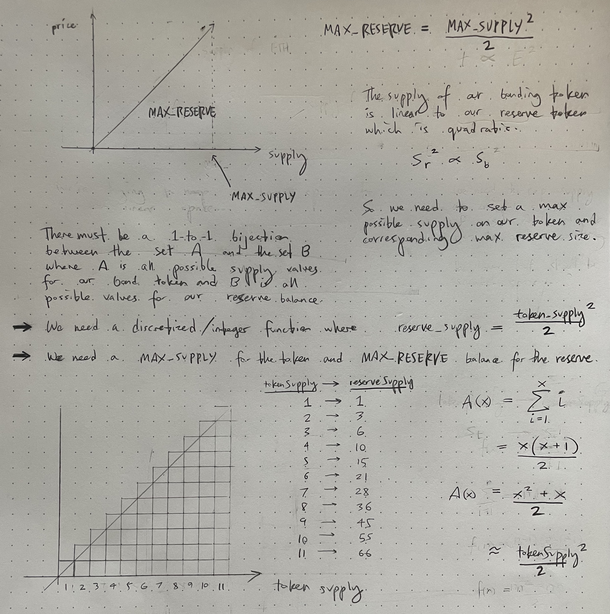

# Bonding Curve token

## spec

- [x] **Solidity contract 3:** (**hard**) Token sale and buyback with bonding curve. The more tokens a user buys, the more expensive the token becomes. To keep things simple, use a linear bonding curve. When a person sends a token to the contract with ERC1363 or ERC777, it should trigger the receive function. If you use a separate contract to handle the reserve and use ERC20, you need to use the approve and send workflow. This should support fractions of tokens.
- [x] We have intentionally omitted other resources for bonding curves, we encourage you to find them on your own.
- [ ] Consider the case someone might [sandwhich attack](https://medium.com/coinmonks/defi-sandwich-attack-explain-776f6f43b2fd) a bonding curve. What can you do about it?

## math

## sandwich attacks

One possible mitigation to sandwich attacks might be to have a delay of X blocks between minting and redeeming tokens... ie. a buyer cannot redeem until 25 blocks have passed since their mint... Not sure this is a good approach though.

## tests

| File                      | % Lines         | % Statements    | % Branches    | % Funcs       |
| ------------------------- | --------------- | --------------- | ------------- | ------------- |
| src/BondingCurveToken.sol | 100.00% (18/18) | 100.00% (25/25) | 90.00% (9/10) | 100.00% (4/4) |
| src/PurchaseToken.sol     | 100.00% (1/1)   | 100.00% (1/1)   | 100.00% (0/0) | 100.00% (1/1) |
| Total                     | 100.00% (19/19) | 100.00% (26/26) | 90.00% (9/10) | 100.00% (5/5) |
